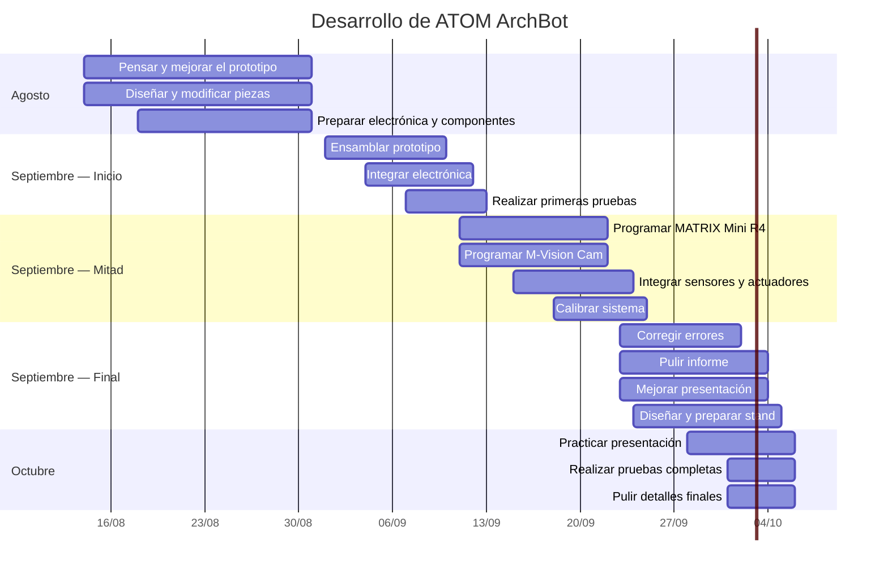

# 📅 Calendario de desarrollo — ATOM ArchBot

Este documento presenta la **planificación general de trabajo de ATOM ArchBot** durante las últimas etapas de desarrollo del prototipo.

El calendario funciona como una guía para organizar los objetivos del equipo y mantener una visión clara de lo que debería estar desarrollándose en cada etapa.

> [!IMPORTANT]
> Las fechas son **objetivos estimados** y pueden modificarse dependiendo de los resultados obtenidos durante la construcción, programación y pruebas del robot.
>
> El desarrollo de un prototipo es un proceso iterativo, por lo que algunas etapas pueden adelantarse, retrasarse o superponerse.

---

# 🗓️ Línea de tiempo general



> La línea vertical del gráfico indica la **fecha actual**, permitiendo visualizar rápidamente en qué etapa del desarrollo debería encontrarse el proyecto.

---

# 🟥 AGOSTO

## 💡 Etapa 1 — Pensar, diseñar y modificar

### Objetivo principal

Tener definido el diseño mecánico y electrónico del prototipo antes de comenzar el ensamblaje completo.

### 🔧 Trabajo esperado

* Diseñar las piezas faltantes.
* Modificar piezas que presenten problemas.
* Revisar medidas del prototipo.
* Adaptar piezas al espesor real del acrílico.
* Terminar el mecanismo del harnero.
* Terminar el sistema de movimiento de la bandeja.
* Diseñar los soportes de sensores.
* Definir la ubicación de la M-Vision Cam.
* Definir la ubicación de las luces RGB.
* Organizar el cableado.
* Preparar canaletas y soportes.
* Revisar alimentación.
* Preparar baterías, BMS, interruptor y conexiones.
* Actualizar la documentación del proyecto.

### 🎯 Meta de agosto

```text
DISEÑO DEFINIDO
      +
PIEZAS PREPARADAS
      +
ELECTRÓNICA PLANIFICADA
```

La prioridad durante agosto es **resolver problemas antes de ensamblar definitivamente el robot**.

---

# 🟧 PRINCIPIOS DE SEPTIEMBRE

## 🔩 Etapa 2 — Ensamblaje

### Objetivo principal

Transformar todas las piezas diseñadas durante agosto en un **prototipo físico completo**.

### 🔧 Trabajo esperado

* Cortar las piezas definitivas de acrílico.
* Imprimir piezas 3D.
* Ensamblar la estructura.
* Montar el harnero.
* Instalar los servomotores.
* Instalar la bandeja.
* Instalar los motores DC.
* Instalar el final de carrera.
* Montar la M-Vision Cam.
* Instalar los sensores láser.
* Instalar las pantallas.
* Instalar las luces RGB.
* Incorporar la alimentación.
* Ordenar el cableado interno.

---

## 🧪 Primeras pruebas

Una vez ensamblado el robot se deben comprobar individualmente los principales sistemas.

```text
ESTRUCTURA
    ↓
MOVIMIENTOS
    ↓
ELECTRÓNICA
    ↓
SENSORES
    ↓
PRIMERAS PRUEBAS
```

### 🎯 Meta de principios de septiembre

**ATOM ArchBot ensamblado y preparado para comenzar la programación completa.**

---

# 🟨 MEDIADOS DE SEPTIEMBRE

## 💻 Etapa 3 — Programación

Esta etapa estará enfocada principalmente en desarrollar el comportamiento real del robot.

---

## 🧠 MATRIX Mini R4

Se comenzarán a integrar progresivamente:

* Servomotores.
* Motores DC.
* Pulsadores.
* Final de carrera.
* Sensores láser.
* Pantallas.
* RGB.
* Buzzer.
* Estados del sistema.
* Autodiagnóstico.
* Comunicación con la cámara.

---

## 📷 M-Vision Cam

Se continuará desarrollando el sistema de visión artificial.

Entre las principales pruebas se encuentran:

* Detección de color.
* Análisis de formas.
* Filtrado de objetos.
* Seguimiento.
* Confirmación mediante varios fotogramas.
* Reducción de falsos positivos.
* Pruebas con diferentes iluminaciones.
* Comunicación UART con MATRIX.

---

## 🔗 Integración

Los diferentes programas deberán comenzar a funcionar como un único sistema:

```text
SENSORES
    ↓
MATRIX
    ↕
M-VISION
    ↓
DECISIONES
    ↓
ACTUADORES
```

### 🎯 Meta de mediados de septiembre

Conseguir que **ATOM pueda ejecutar de forma autónoma las principales funciones propuestas**.

---

# 🟩 FINALES DE SEPTIEMBRE

## 🧪 Etapa 4 — Pruebas y correcciones

Una vez integrado el sistema, la prioridad cambia de agregar funciones a conseguir que las funciones existentes sean **confiables**.

### 🔧 Trabajo esperado

* Realizar ciclos completos de harneado.
* Detectar errores.
* Corregir problemas mecánicos.
* Ajustar velocidades.
* Ajustar ángulos.
* Calibrar sensores láser.
* Calibrar visión artificial.
* Revisar falsos positivos.
* Comprobar alertas.
* Revisar funcionamiento de la bandeja.
* Probar autodiagnóstico.
* Revisar autonomía.
* Ordenar definitivamente el cableado.

---

# 🎤 FINALES DE SEPTIEMBRE — PRINCIPIOS DE OCTUBRE

## 🗣️ Etapa 5 — Presentación

Cuando el prototipo esté funcionando, una parte importante del trabajo pasará a ser **comunicar correctamente el proyecto**.

### 🎤 Presentación oral

* Practicar el speech.
* Definir quién explica cada parte.
* Controlar tiempos.
* Preparar respuestas a posibles preguntas.
* Practicar demostraciones.
* Explicar claramente el problema.
* Explicar la solución.
* Explicar las mejoras respecto a versiones anteriores.
* Explicar la visión artificial.
* Explicar el funcionamiento del robot.

---

# 📄 Informe y presentación

Durante esta etapa también se deberán revisar los materiales escritos.

### Informe

* Revisar redacción.
* Agregar avances del prototipo.
* Actualizar fotografías.
* Incorporar resultados de pruebas.
* Revisar diagramas.
* Explicar cambios realizados.
* Corregir errores.

### Presentación

* Simplificar textos.
* Utilizar imágenes claras.
* Actualizar fotografías del robot terminado.
* Revisar diagramas.
* Mostrar evolución V1 → V2 → V3.
* Preparar demostraciones.

---

# 🏕️ Stand

El stand también deberá considerarse como una parte importante de la presentación de ATOM ArchBot.

Durante finales de septiembre se deberán definir:

* Distribución de la mesa.
* Posición del robot.
* Espacio para demostraciones.
* Paneles informativos.
* Fotografías.
* Diagramas.
* Evolución del proyecto.
* Código QR.
* Material arqueológico demostrativo.
* Iluminación.
* Elementos decorativos.
* Organización de cables.
* Espacio para interacción con visitantes.

---

## 🎯 Objetivo del stand

El stand debería permitir entender rápidamente:

```text
¿QUÉ PROBLEMA EXISTE?
        ↓
¿QUÉ ES ATOM ARCHBOT?
        ↓
¿CÓMO FUNCIONA?
        ↓
¿CÓMO FUE DESARROLLADO?
        ↓
¿QUÉ RESULTADOS OBTUVO?
```

---

# 🟦 PRINCIPIOS DE OCTUBRE

## 🏁 Etapa 6 — Pulido final

En esta etapa la prioridad será **no agregar funciones innecesarias**, sino mejorar la confiabilidad de todo lo que ya existe.

### Prioridades

* Corregir errores restantes.
* Realizar pruebas completas.
* Revisar tornillos y uniones.
* Comprobar conexiones.
* Cargar baterías.
* Preparar repuestos.
* Revisar programación.
* Respaldar códigos.
* Respaldar documentación.
* Practicar presentación.
* Preparar el stand.
* Preparar demostración.

---

# 🎯 Resumen de objetivos

| Periodo                                          | Objetivo principal            |
| ------------------------------------------------ | ----------------------------- |
| 🟥 Agosto                                        | Pensar, diseñar y modificar   |
| 🟧 Principios de septiembre                      | Ensamblar                     |
| 🟨 Mediados de septiembre                        | Programar                     |
| 🟩 Finales de septiembre                         | Probar y corregir             |
| 🟦 Finales de septiembre / principios de octubre | Presentación, informe y stand |
| 🏁 Principios de octubre                         | Pulir todos los detalles      |

---

# 🔄 Filosofía de desarrollo

El calendario no busca obligar al proyecto a seguir fechas rígidas.

La idea es mantener una dirección clara:

```text
PENSAR
   ↓
DISEÑAR
   ↓
CONSTRUIR
   ↓
PROGRAMAR
   ↓
PROBAR
   ↓
CORREGIR
   ↓
PRESENTAR
```

Si una prueba demuestra que algo debe cambiar, se puede volver a una etapa anterior y modificarlo.

---

# ✅ Objetivo final

Llegar a principios de octubre con:

* ✅ Prototipo ensamblado.
* ✅ Sistema mecánico probado.
* ✅ Electrónica integrada.
* ✅ Programación funcional.
* ✅ Visión artificial calibrada.
* ✅ Sistema probado varias veces.
* ✅ Informe actualizado.
* ✅ Presentación terminada.
* ✅ Stand definido.
* ✅ Equipo preparado para explicar y demostrar ATOM ArchBot.

---

# 🏺 ATOM ArchBot

**Diseñar → construir → programar → probar → mejorar → presentar.**
